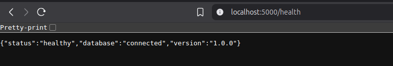
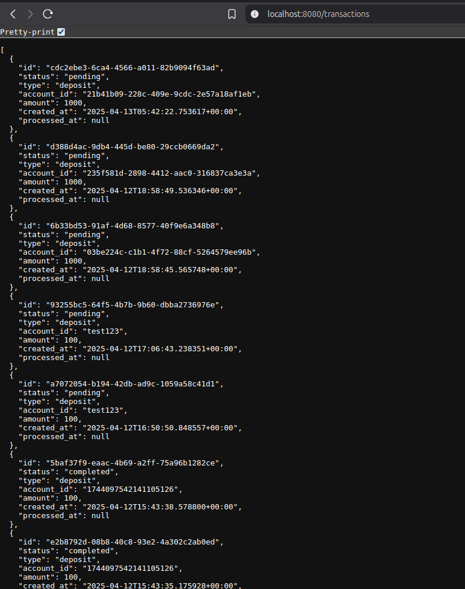
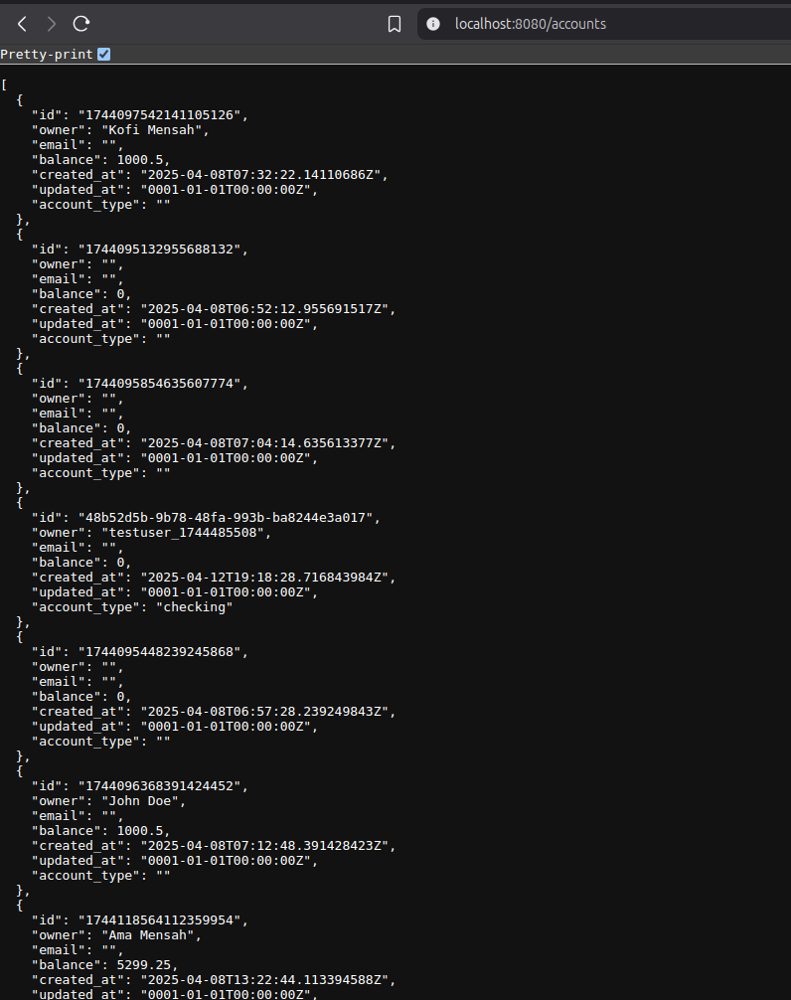

# Assignment 5: Service Discovery and Networking

## Objective
Create a multi-tier application with proper service discovery:
1. Backend Deployment (2 replicas) with ClusterIP Service (flask api)
2. Frontend Deployment (2 replicas) with LoadBalancer Service (go api)
3. Demonstrate frontend-backend communication using service names (instead of the frontend I used a go api to make http request to the flask api)

## Implementation

### 1. Cluster Setup & Helm Initialization

```
    helm create bank-app
    kind create cluster --name bank-cluster
    kind config use-context bank-cluster
    kubectl config use-context bank-cluster
    kubectl config use-context kind-bank-cluster
```
I began by creating the Kubernetes cluster using Kind, then scaffolded a Helm chart with helm create. After that, I configured the Kubernetes context and started modifying the Helm templates for the Flask and Go services.


### 2. Troubleshooting & Iteration

It took over an hour of trial and error to get everything functioning correctly. I ran into several issues related to Helm directory structure, chart values, and debugging manifests. Here’s a summary of the commands and steps I went through:
```
# Initial (non-functional) attempts using the root Helm directory
helm install flask-api ./orchestration/bank-app/ -f ./orchestration/bank-app/values.yaml
helm install flask-go ./orchestration/bank-app/ -f ./orchestration/bank-app/values.yaml

# Realized each service needed its own chart folder
helm install flask-api ./orchestration/bank-app/flask/
helm install flask-api ./orchestration/bank-app/templates/flask/
helm uninstall flask-api

# Debugging deployments and resources
kubectl get deploy
kubectl get po
kubectl get ns
helm list

# Dry run and manifest inspection
helm install flask-api ./orchestration/bank-app/templates/flask/ --debug --dry-run
helm get manifest flask-api
helm upgrade flask-api ./orchestration/bank-app/templates/flask/ -f ./orchestration/bank-app/templates/flask/values.yaml --debug


```
Once I corrected the Helm folder structure, this is what finally worked:

### Backend (Flask) Deployment

```
cd cicd/orchestration/bank-app/
helm install flask-api ./flask/ -f ./flask/values.yaml
kubectl get deploy

```

I forwarded the service port and tested the health endpoint locally:

```
kubectl port-forward svc/flask-backend-service 5000:5000
curl http://localhost:5000/health

```



### Go API Deployment

```
helm install go-api ./go/ -f ./go/values.yaml
kubectl get deploy

```
Once it worked I tested the Go service by forwarding its port and verifying it could communicate with the Flask backend using service discovery:

```
kubectl port-forward svc/corebank-api 8080:80
curl http://localhost:8080/accounts
curl http://localhost:8080/transactions

```



### 3. Install MetalLB for LoadBalancer Support

Since kind does not natively support LoadBalancer services, I installed MetalLB to enable external access from outside the cluster:
```
    # Apply MetalLB manifests
    kubectl apply -f https://raw.githubusercontent.com/metallb/metallb/v0.13.10/config/manifests/metallb-native.yaml

    # Create MetalLB config map with address pool
    kubectl apply -f metallb-config.yaml
```
This allowed the LoadBalancer service type to function within the Kind cluster, making the Go API reachable outside the cluster for testing frontend-backend communication.

### 4. Clean up
```
# Remove Flask and Go services
helm uninstall flask-api
helm uninstall go-api
kind delete cluster --name bank-cluster
```