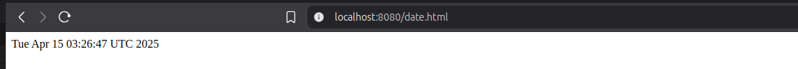
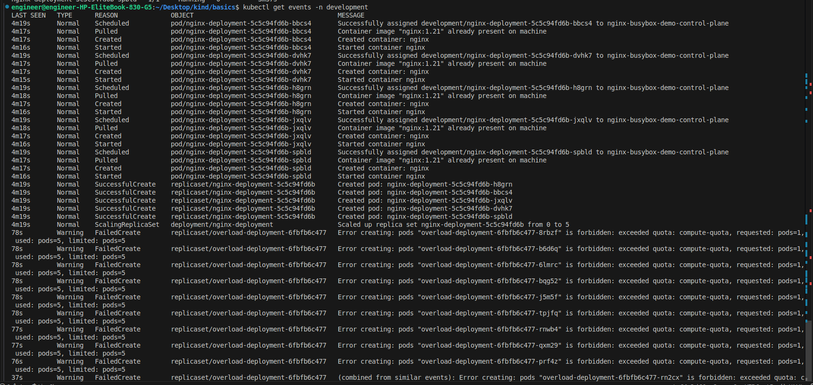
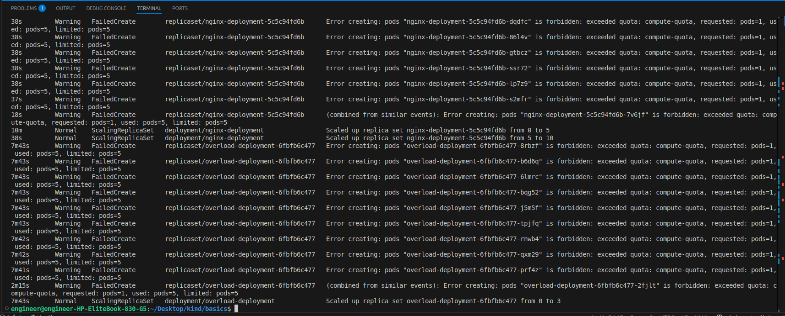

# Kubernetes Basics: Take-Home Assignments

Before I started Started creating I created the a kind cluster 
```
    kind create cluster --name nginx-busybox-demo
```
## Assignment 1: Multi-Container Pod
### Files Created:

-   nginx-pod.yml

Create a Pod with two containers:
### Commands Used
```
    kubectl apply -f nginx-pod.yml
    kubectl get po
    kubectl get po -owide
    kubectl port-forward pod/nginx-pod 8080:80
```


## Assignment 2: Rolling Update Strategy
In this is part of the assignemnt I tried both for the nginx and httpd deployment
### Files Created:
-   nginx-deployment.yaml
-   httpd-deployment.yaml

Create a Deployment with the following specifications:
### Commands Used
```
    kubectl apply -f nginx-deployment.yaml
    kubectl get deploy
    kubectl get po
    kubectl set image deployment/nginx-deployment nginx=nginx:1.20
    kubectl rollout status deployment/nginx-deployment
    kubectl get deployment -owide
```


## Assignment 3: ConfigMap and Secret Management
### Files Created:
-   configmap.yaml
-   secret.yaml
-   pod-config.yaml

Create an application that uses both ConfigMaps and Secrets:
### Commands Used
```
    kubectl apply -f configmap.yaml -f secret.yaml -f pod-config.yaml
    kubectl get po
    kubectl describe po app-pod
    # Cleanup
    kubectl delete -f pod-config.yaml -f secret.yaml -f configmap.yaml
```
## Assignment 4: Resource Management
### Files Created:
- namespace.yml
- namespace-too-many-pods.yaml
- namespace-deployment.yml
- namespace-resource-quota.yaml
- namespace-limit-range.yaml

Create a namespace with resource quotas and limits:
### Commands Used
```
    touch namespace.yml
    kubectl apply -f namespace.yml
    kubeclt get ns
    kubectl get ns
    touch namespace-deployment.yml
    touch namespace-resource-quota.yaml
    touch namespace-limit-range.yaml
    kubectl apply -f namespace-resource-quota.yaml -f namespace-limit-range.yaml
    kubectl apply -f namespace-deployment.yml
    kubectl get deployment
    kubectl get deployment development
    kubectl get deployments -n development
    kubectl get po
    kubectl get po -n development
    touch namespace-too-many-pods.yaml
    kubectl apply -f namespace-too-many-pods.yaml
    kubectl get po -n development
    kubectl get events -n development
    kubectl get deploy -n development
    # Attempt to scale beyond quota
    kubectl scale deployment nginx-deployment --replicas=10 development
    kubectl scale deployment nginx-deployment --replicas=10 -n development
    kubectl apply -f namespace-too-many-pods.yaml
    # Check for quota violation errors
    kubectl get events -n development
    # Patch the quota to allow more pods but failed so I did manually 
    kubectl patch resourcequota limited-resources -n development --patch '{"spec":{"hard":{"pods":"10"}}}'
    kubectl patch resourcequota compute-quota -n development --patch '{"spec":{"hard":{"pods":"10"}}}'
    kubectl patch resourcequota compute-quota -n development --patch '{"spec":{"hard":{"pods":"15"}}}'
    # Test for quota violation errors again with too many and above number of pods
    kubectl apply -f namespace-too-many-pods.yaml
    kubectl get events -n development
    # Manually Updateing the pods in the file
    kubectl apply -f namespace-resource-quota.yam
    kubectl apply -f namespace-resource-quota.yaml
    kubectl apply -f namespace-too-many-pods.yaml
    kubectl get events -n development
    kubectl get deploy -n development
    kubectl get po -n deve
```
